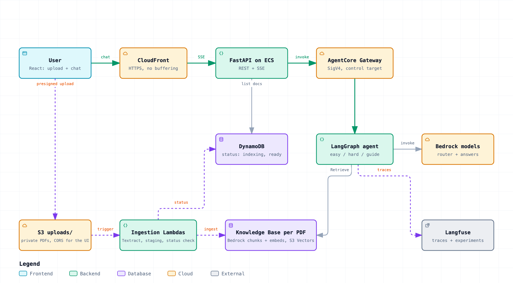

<div align="center">

<h1>Doc Pipeline Agentic RAG</h1>

<p><strong>Upload a PDF. Ask it anything. Get streamed, cited answers.</strong></p>

<p>
A generic document-QA system for any PDF. Upload one from the UI (or drop it into S3) and a pipeline extracts its
structure with Amazon Textract, then a dedicated Bedrock Knowledge Base (S3 Vectors) chunks and embeds it with
Bedrock's built-in ingestion — semantic chunking by default, other strategies per upload. Pick the document in the UI
and a LangGraph orchestrator routes each question to a quick lookup, a multi-step reasoning workflow, or an exhaustive
step-by-step guide — streaming the answer to you as it is written.
</p>

<p>


</p>

</div>

---

## Architecture

<picture>
  <source media="(prefers-color-scheme: dark)" srcset="docs/architecture-dark.png">
  
</picture>

The interactive version (theme switch, search, trace a relationship, export) can be opened in the browser through
[htmlpreview](https://htmlpreview.github.io/?https://github.com/alvarog2491/doc-pipeline-agentic-RAG/blob/main/docs/architecture.html)
or [raw.githack](https://raw.githack.com/alvarog2491/doc-pipeline-agentic-RAG/main/docs/architecture.html) (GitHub itself only
shows HTML as source). The file is [docs/architecture.html](docs/architecture.html) and its source is
[docs/architecture.diagram.json](docs/architecture.diagram.json).

```
apps/
├── agents/            # LangGraph orchestrator (easy / hard / guide) on AgentCore; Langfuse + evaluations
├── api/               # FastAPI REST + Server-Sent Events API
├── frontend/          # React chat UI: PDF upload, document dropdown, streamed answers with page citations
├── ingestion/         # Lambdas: Textract -> per-page Markdown -> per-PDF Knowledge Base; Bedrock chunks + embeds
└── online-evaluators/ # Deterministic AgentCore code-based evaluators for the release gate
terraform/             # ecr, data, agentcore, evaluations, alb, ecs, cloudfront modules + bootstrap + tests
docs/                  # architecture diagram
scripts/               # Everything `make` does - see scripts/README.md
packages/              # config-ts, shared-types (SSE event types and validation)
```

### The orchestrator

Every turn is classified by an LLM router (`route` + a standalone rewrite of the question), then dispatched:

| Route | Workflow |
|---|---|
| **easy** | one retrieval → one streamed, cited answer |
| **hard** | decompose → parallel retrieval → cross-check for gaps (one more round at most) → streamed synthesis |
| **guide** | outline the procedure → **subagents** extract each section and the prerequisites in parallel → streamed, numbered, cited guide |

See [apps/agents/README.md](apps/agents/README.md).

### Streaming

`POST /v1/chat/stream` answers with Server-Sent Events (`route`, `progress`, `delta`, `citations`, `completed`),
flushed as the agent emits them, so the first words appear while the rest is still being written. Answers cite
excerpts as `[[n]]`, rendered as links that open the exact PDF page in a side panel (short-lived presigned URLs —
documents are private).

### Uploading documents

Click **Upload PDF** in the header, optionally choose how the document is split, and pick a file. The browser gets a
presigned S3 POST from `POST /v1/documents/upload` and sends the PDF **straight to S3** (with a progress bar), so it never
passes through CloudFront, the load balancer or the API. The document then shows in the dropdown as
`(extracting…)` → `(indexing…)` and becomes selectable when `READY` (seconds for a short PDF; large ones take longer, and
Bedrock's ingestion job is observed by a scheduled Lambda rather than blocking one).

| Chunking | Best for |
|---|---|
| Automatic (semantic, default) | articles, manuals, reports |
| Long documents (hierarchical) | long structured documents |
| Uniform text (fixed size) | logs, transcripts |
| One chunk per page | slides, forms, invoices |

Limits: PDF only, 100 MB by default (set `MAX_UPLOAD_MB` on the API task to change it), and uploading a file with the same name replaces and re-ingests that
document. Scanned PDFs work (Textract OCR); blank or unreadable ones end `FAILED` with the reason. The API has no login, by
design, so anyone who can reach it can upload; keep it private or add an upload key before exposing it. Details:
[apps/ingestion/README.md](apps/ingestion/README.md).

## Prerequisites

- **Node.js** ≥ 22 and **pnpm** ≥ 9
- **Python 3.12+** and [uv](https://docs.astral.sh/uv/getting-started/installation/)
- **Terraform** ≥ 1.10 and **Docker**
- **AWS CLI** configured with credentials that have Bedrock, AgentCore, Textract and S3 Vectors access, in a region
  where those services (and S3 Vectors) are available — `eu-central-1` by default

## Getting Started

```bash
pnpm install                # JS dependencies
uv sync --all-packages      # every Python app into the shared ./.venv
make tf-test                # validate the infrastructure code, no AWS needed
```

There is **no `.env` to fill in.** `make compose-up` and `make run-agent` resolve everything at launch — AWS
credentials from your active profile, config from [`terraform/defaults.json`](terraform/defaults.json) (which
Terraform reads too), and table / bucket / gateway names from Terraform outputs. A `.env` is still honoured as an
optional personal override.

### First-time bootstrap

Select your AWS profile and region, then, once per AWS account:

```bash
export AWS_PROFILE=my-profile
export AWS_REGION=eu-central-1

make tf-bootstrap                        # S3 bucket that holds Terraform state (native S3 locking)
```

And once per environment, the Langfuse credentials (never created by Terraform, so a destroy cannot delete them):

```bash
aws ssm put-parameter --type SecureString \
  --name "/doc-pipeline-agent/dev/langfuse" \
  --value '{"publicKey":"pk-lf-...","secretKey":"sk-lf-..."}'
```

### Deploy dev and ask a question

```bash
make dev-deploy                               # images (unique tag per deploy), every Terraform module, ECS rollout
make dev-verify                               # ECS, ALB, CloudFront and a real agent answer end to end
make run-frontend-dev                         # http://localhost:5173, proxying /v1 to the deployed API
```

Then click **Upload PDF** in the app, or upload from the terminal:

```bash
make upload-document PDF=path/to/manual.pdf   # waits until READY
make upload-document PDF=deck.pdf CHUNKING=none   # semantic (default) | hierarchical | fixed | none
make list-documents
```

The `cloudfront_domain` output (`https://d….cloudfront.net`) serves **the API only**: `/` returns 404 by design, while
`/health`, `/docs` and `/v1/…` work. The frontend is run locally (above) or hosted separately (see *Deploying*). During a
redeploy the dev API can answer 503 for a minute while ECS swaps tasks. `make dev-destroy` removes everything in dev except
the Langfuse credentials and the state bucket.

Or run everything locally against the deployed dev data with `make compose-up` (frontend on
[http://localhost:3000](http://localhost:3000)). Each PDF creates a Knowledge Base (Bedrock's default quota is 100 per
account and region — request an increase for large corpora). Deleting the object from `uploads/` removes its
Knowledge Base, vector index, staged pages and registry entry.

## Verify

```bash
pnpm -r test
pnpm -r build
make tf-test

(cd apps/agents && uv run --package DocPipelineAgent python -m pytest -q)
(cd apps/api && uv run --package doc-pipeline-api python -m pytest -q)
(cd apps/ingestion && uv run --package DocPipelineIngestion python -m pytest -q)
(cd apps/online-evaluators && uv run --package DocPipelineOnlineEvaluators python -m pytest -q)
uv run --package doc-pipeline-api python -m pytest -q scripts/tests
```

## Evaluations

**No score uses an LLM as a judge**, so evaluating costs only the agent invocations. Datasets are written against a
small synthetic handbook that is rendered to a PDF at run time (no committed binary) and ingested through the real
pipeline. Scores are computed from the run itself: `route_accuracy`, `retrieval_recall`, `citation_validity`,
`keyfact_recall`, `abstention_correct`, `guide_step_coverage` / `guide_order_validity`, `subagent_use`,
`tool_budget`, `ttft_within_budget`, and more.

```bash
make experiment-easy      # / experiment-hard / experiment-guide / experiments
```

In CI, `cd-staging.yml` runs them on every pull request and posts the scores as a PR comment (advisory). Details,
metrics and thresholds: [apps/agents/evaluations/README.md](apps/agents/evaluations/README.md).

## Deploying

Manual deployments are allowed only for `dev`. Staging and production are deployed only through GitHub Actions:

- **`cd-staging.yml`** (pull request): builds both images, applies Terraform to the staging environment, verifies
  the deployment end to end (ECS, ALB, CloudFront, a real agent answer about an uploaded document), runs the
  experiments, then tears the compute down.
- **`cd-production.yml`** (push to main): applies infrastructure with Terraform, then
  [`alvarog2491/agentcore-ab-release-gate`](https://github.com/alvarog2491/agentcore-ab-release-gate) A/B tests the new
  agent image against the current `control` version on live Gateway traffic. Both variants are scored by the
  **online evaluators** Terraform created (`ErrorFree`, `LatencyBudget`, `GroundedRetrieval`, `RetrievalBudget` —
  deterministic Lambda checks over the session's OpenTelemetry spans, no LLM judge). The candidate is promoted only if
  every quality gate passes; otherwise the control version keeps serving. The first deployment has nothing to compare
  against and is applied directly.
- **`terraform-drift-detection.yml`** runs `terraform plan -detailed-exitcode` nightly against prod.

### GitHub configuration

The workflows need, per GitHub Environment (`staging`, `production`): the variable `AWS_DEPLOY_ROLE_ARN` (an OIDC role that
can run Terraform in that account), plus the repository/environment variables `AWS_REGION`, and optionally
`LANGFUSE_BASE_URL` and `FRONTEND_ORIGIN` (the hosted frontend's origin, allowed by the API's CORS **and** by the documents
bucket for browser uploads). The Langfuse keys for staging experiments are the secrets `LANGFUSE_PUBLIC_KEY` /
`LANGFUSE_SECRET_KEY`. The first production deploy is a manual dispatch (the agent image must exist before the runtime is
created). Without this configuration `cd-production.yml` fails on every push to `main`.

### Hosting the frontend

Terraform does not host the frontend. Serve `apps/frontend/dist` from any static host (for example Vercel) and build it with:

```text
VITE_API_URL=https://<cloudfront_domain>
```

Without `VITE_API_URL` the app uses a same-origin `/v1` proxy (Vite in development, nginx in `make compose-up`). Set
`FRONTEND_ORIGIN` to the host's origin so uploads and API calls are allowed. See [terraform/](terraform/) and
[AGENTS.md](AGENTS.md) for the environment model and invariants.
