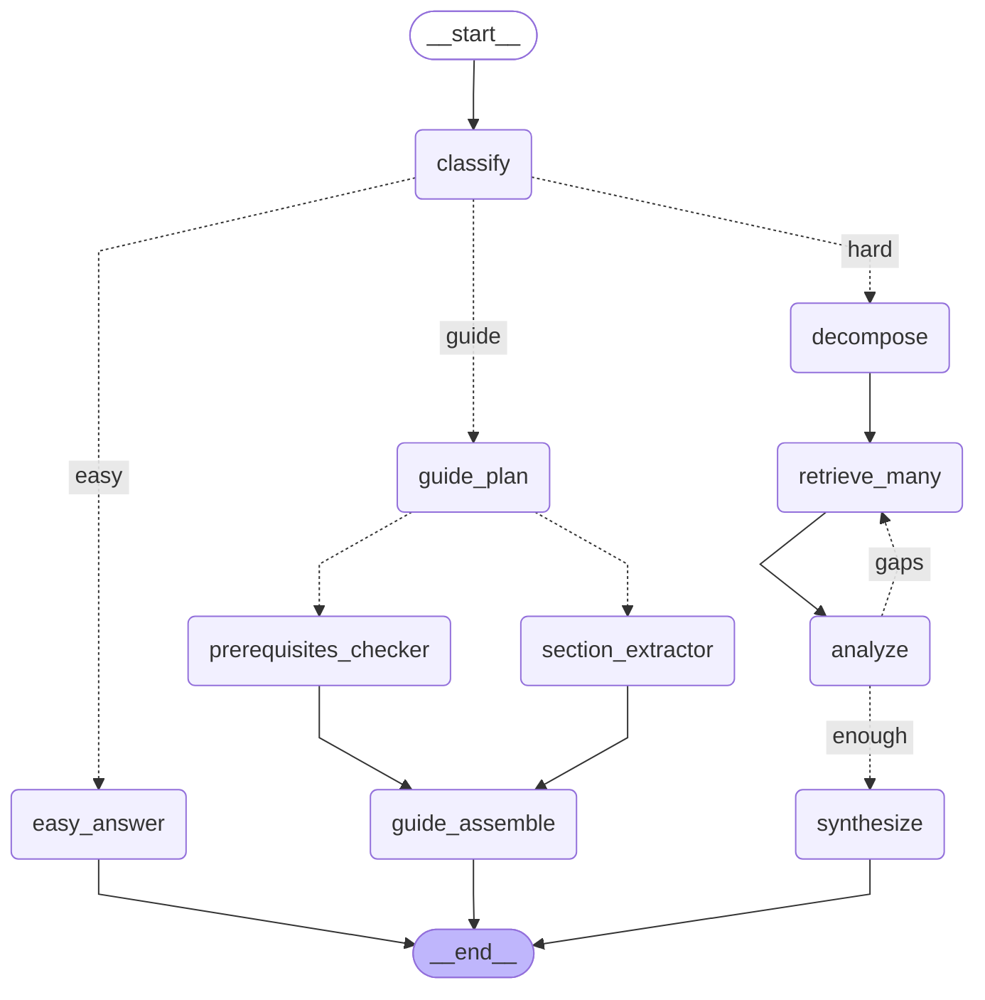

# Agent

Python LangGraph orchestrator deployed to Amazon Bedrock AgentCore Runtime. The user picks one
uploaded document (one Bedrock Knowledge Base per PDF); every turn is routed by an LLM router to
one of three workflows.

<!-- graph:start -->

<!-- graph:end -->

The diagram above is generated from the compiled graph by LangGraph itself (`get_graph().draw_mermaid()`); dotted edges are
conditional. Refresh it after changing `graph.py` with `uv run --package DocPipelineAgent python graph_diagram.py --write`; a test
fails when it is stale.

| Route | When | What runs |
|---|---|---|
| `easy` | a fact, definition, or small talk | one retrieval (5 passages), then one streamed, cited answer. First token arrives after the router call and one search. |
| `hard` | needs comparing, combining or reasoning | sub-question decomposition, parallel retrieval, an `analyze` cross-check (one gap-filling round at most), then a streamed synthesis. |
| `guide` | a complete step-by-step procedure | overview retrieval and an outline, then subagents (`section_extractor` per section, `prerequisites_checker`) run in parallel via `Send` and cover the whole document; the result is a streamed, ordered, cited guide. |

Only the final answer is streamed. Everything the client sees (`route`, `progress`, `chunk`, and the final
`citations`) goes through `events.emit`, so internal model calls never leak into the response. Answers cite
excerpts as `[[n]]`; `citations.py` resolves those markers to `{page, source, section}` after the run.

## Runtime contract

Request: `{"prompt": "...", "knowledgeBaseId": "<10-char id>"}`, or `{"type": "feedback", "outcome": "helpful|not_helpful", "comment": "..."}`.
The AgentCore session id keeps the conversation (`thread_id = <session>:<knowledgeBaseId>`); it is not an auth boundary.

Response events, in order: `{"route": ...}`, `{"progress": ...}`*, `{"chunk": ...}`*, `{"citations": [...]}`.

## Layout

| Path | Description |
|---|---|
| `main.py` | AgentCore entrypoint: validates the payload, streams graph events, records Langfuse metadata (`route`, retrieved excerpts, citations) and feedback scores. |
| `graph.py` | `build_agent`: wires the nodes above into a `StateGraph` with an in-memory checkpointer. |
| `graph_diagram.py` | Draws the compiled graph with LangGraph's own `draw_mermaid()` and keeps the diagram above in sync (`--write`). |
| `router.py`, `easy.py`, `hard.py`, `guide.py` | The nodes of each workflow. |
| `state.py` | Graph state and the Pydantic schemas for structured model outputs. |
| `nodes_common.py`, `llm.py`, `events.py` | Shared dependencies, model-call helpers, and the custom event stream. |
| `excerpts.py`, `citations.py`, `retrieval.py` | Numbered excerpts, marker resolution, and Bedrock `Retrieve` on the selected Knowledge Base. |
| `prompts/` | Git-versioned Langfuse chat prompts (see `prompts/README.md`). |
| `prompting.py`, `langfuse_client.py`, `observability.py` | Prompt loading, Langfuse client, W3C trace-context propagation. |
| `model/` | Bedrock Converse model factory (`BEDROCK_MODEL_ID`; optional smaller `BEDROCK_ROUTER_MODEL_ID` for `classify`). |
| `evaluations/` | Langfuse datasets, deterministic scorers and experiments. |

## Run

```bash
uv run --package DocPipelineAgent python -m pytest -q     # from apps/agents
uv run --package DocPipelineAgent python main.py          # ASGI server on 0.0.0.0:8080
```

## Docstrings

Python code here uses [Google-style docstrings](https://google.github.io/styleguide/pyguide.html#38-comments-and-docstrings):
a one-line summary followed, where they apply, by `Args:`, `Returns:`, `Yields:` and `Raises:` sections.
